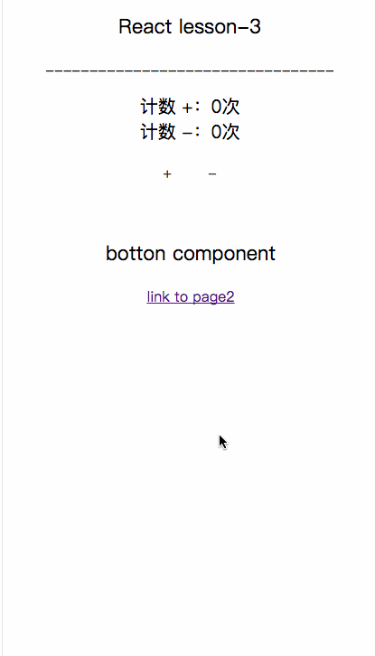

## 构建 React 项目开发模板

### 前言：
在 `lesson-1 :构建一套适合 React、ES6 开发的脚手架`,`lesson-2 : Redux 的设计思想`,
我们已经对利用 React 构建项目有了一些基础知识，那推出 `构建 React 项目开发模板` 是为了在
实际的项目中有一套完善的体系或机制来迎合我们实际的开发需求，比如在 lesson-2 中，虽然我们已经
能让项目带着 Redux 这么一个数据状态管理机器给运转起来了，那 lesson-3 就是对 React 结合
react-redux 进一步封装，使开发更加清爽，项目也更加容易迭代和维护。

先看一下本项目封装完的一个案例：




### 我们还需要一些中间件
在封装项目的过程中，我们还需要一些好用的中间件来支持我们的封装。
#### 1、combineReducers
`combineReducers` 函数是用来对 reducer 函数进行拆分的。我们在 reducer 函数里进行case 多条来着
Action 派发过来的数据，并返回 State ，但在项目复杂，数据一多的情况下，在一个reducer 函数里面处理
多条不同的数据就显得比较乱：
```
const chatReducer = (state = defaultState, action = {}) => {
  switch (action.type) {
    case TYPE1:
      // ...
       return state;
    case TYPE2:
       // ...
     return state;
    case TYPE3:
       // ...
    return state;
       //...
    default: return state;
  }
};
```
有了 `combineReducers` 我们可以这么写 reducer：
```
//  reducer.jsx
export const reducerData1 =  (state ={}, action={}) => {
    switch (action.type){
              case 'TYPE1':
              return {count:233};
        default: return state;
    }
};
export const reducerData2 =  (state ={name:'曾田生'}, action={}) => {
    switch (action.type){
              case 'TYPE2':
              return {
                name:state.name,
                age:'233'
              };
        default: return state;
    }
};
// ...
```
最后绑定到 store上：
```
// store.jsx
import * as reducer from './reducer'
var store = createStore(
    combineReducers(reducer),
    applyMiddleware(thunk)
);
export default store;
```
合并后的 reducer 保存的是各个子reducer的state数据，合并成一个state对象。比如上面 reducer.jsx 得到的数据是：
```
state:{
  reducerData1:{
    count:233
  },
  reducerData2:{
    name:'曾田生',
    age:'233'
  }
}
```

#### 2、applyMiddleware
简单解释是可以包装 store 的 dispatch（） 方法，比如对 store.dispatch（）的时候包装一个异步请求的网络处理机制啊。

#### 3、redux-thunk
虽然 applyMiddleware 允许 store.dispatch（action）多做一些事，但 dispatch 只能接收的参数是一个对象（action），
那怎么多做事呢，redux-thunk 改造了 store.dispatch（），使 dispatch 能接收一个函数做参数，有了函数做参数那么能做
的功能就多了。
```
// action.jsx
export const increase = () => {
  return {type: 'INCREASE'}
}
```
将action绑定到组件上：
```
import  * as action from '../../Redux/action.jsx'

connect(mapStateToProps, action)(Index);

```
注意 action.jsx export 的是函数，而且不用 dispatch（），直接 return action 就可以了，这得力于有了 redux-thunk
帮我们做的事。


# react-redux-antd-demo
